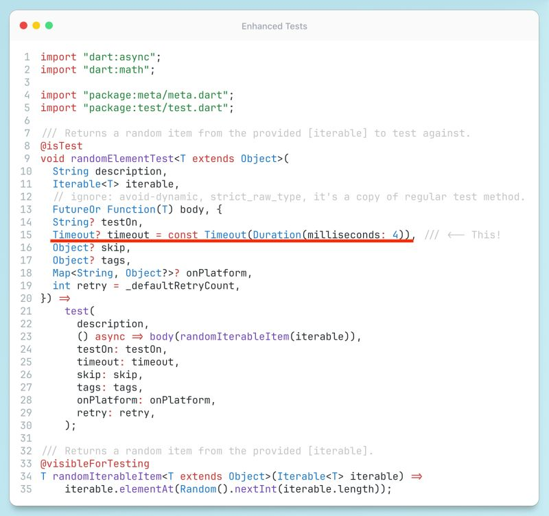

# Better Tests

## Description

 We often strive to refine and enhance our app codebase by building on the SDK's classes and methods, invoking principles like DRY, Clean Code, etc. However, we sometimes overlook applying the same rigor to our tests! You're familiar with that feeling of satisfaction when a test passes, confirming your code executes as expected with predefined parameters—noice! But what about, for example, the test's execution time? This aspect is frequently ignored.

Consider this: Dart's default test timeout is a whopping **30 seconds**. Imagine a scenario where a single test in your suite takes 20 seconds to complete—this goes unnoticed, yet it's far from ideal in Flutter, where we aim for millisecond-level responsiveness to ensure a smooth UI experience. Such delays could be costly, translating to poor user reviews despite having 100% test coverage.

So, here's my advice: always question your tools and their default settings. While SDKs and packages offer a solid foundation, it's up to you to build the structure. By setting a default timeout of a few milliseconds for your tests (which you can adjust as needed, with duration or factor timeouts), you'll quickly spot inefficiencies, particularly with time-consuming operations on large datasets. For instance, a ".where" search on a massive collection can take hundreds of milliseconds, even though it's synchronous. Surprising, right? Or speaking of these collections — embrace randomness in your tests! Instead of always testing with fixed values, create tests that select random elements from your collections. This approach can expose issues that fixed values might miss.

## Example

As always, I'd like to provide a demonstration of a advanced [tests](https://github.com/tsinis/sealed_world/blob/main/packages/_sealed_world_tests/lib/tests/advanced_tests.dart)
