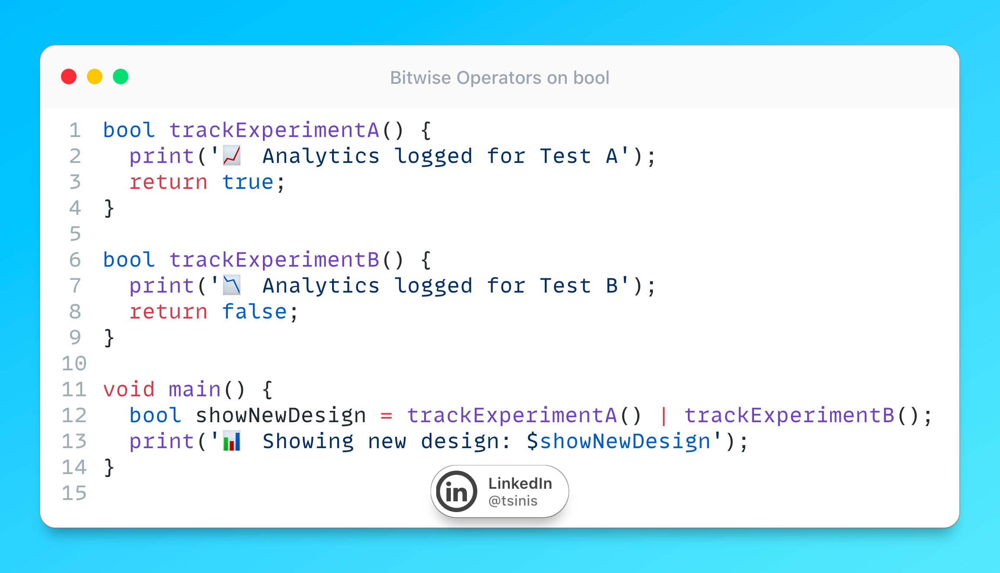

# Bitwise Operators on bool

## Description

Data analytics in the apps can be tricky, so let's talk about a Dart obscure language feature - `^`, `|`, `&` work on `bool`, not just `int`. Unlike `&&` and `||`, these operators always run both sides (no short-circuit).

Perfect when you need both functions to execute in a non-lazy manner — for example, logging analytics in A/B testing. Let's say your data team is missing important A/B testing analytics. They keep telling you some events never show up in the logs. The reason? You are probably using `||` like this (as usual): `isEligibleForTestA() || isEligibleForTestB()`. If the first check returns true, the second one never runs — so some tracking is lost forever. It's totally fine in 99% of cases, but if you need both checks to run, switch to `|` and `&` instead. This way, you get the correct eligibility result while ensuring all analytics are properly logged. Just remember, these operators will evaluate both sides every time, so use them when you need that behavior!

## Example

As always, I'd like to provide a demonstration of it in [DartPad](https://dartpad.dev/e9f000e5c8875fe529cfbaf91a945c3f)
