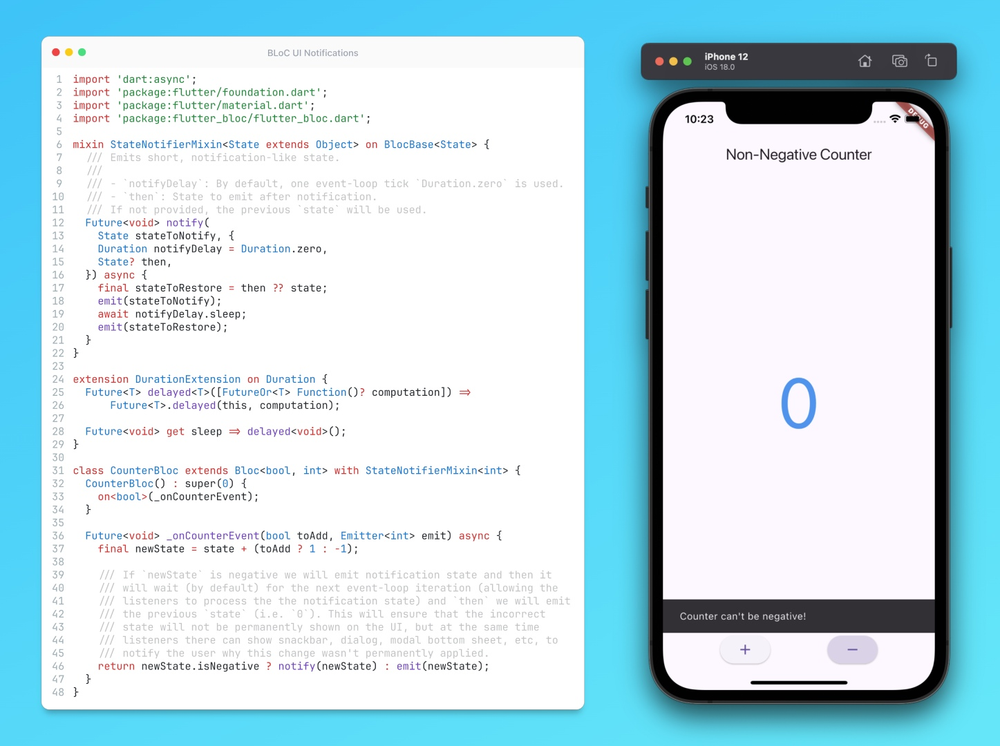

# BLoC UI Notifications

## Description

In today's tip let's talk about one of the most mature Flutter state management packages today - BLoC. It is one of my favorite SM approaches but it has a few shortcomings, for example, it lacks the ability to notify listeners about a specific state change - but without permanently updating the state! For example, to show some error message after a network request or some validation warnings, and so on. One solution you could use for it is to emit a state with a short delay (one event-loop tick) before reverting to the previous state. This allows UI listeners to process the notification state without affecting the overall state of your UI.

In the example code, we have a `CounterBloc` that increments or decrements a counter. However, when the counter reaches a negative value, we want to notify the user that this is not allowed, without actually updating the counter on the UI.

For that, we can extend BLoC with `StateNotifierMixin` that adds a `notify`, emit-like method to it. This method emits a short-lived state with a specified delay (defaulting to one event-loop tick, or `Duration.zero`). After the delay, the previous state is restored.

In our `CounterBloc`, we use this the `notify` method to emit a notification state when the counter reaches a negative value. Our UI listeners can then react to this notification state, for example by showing a snackbar, dialog, bottom sheet, etc.

You can take this approach further by creating interfaces for your states with a boolean flag to distinguish between notification states and regular states. You can also create a custom `BlocConsumer` related to this interface with implicit `when` parameters to simplify your UI code.

## Example

As always, here is a link to [DartPad](https://dartpad.dev/?id=defd3963fc7d83e00f0b50d3b491abbe), where you can play around with it. Another advantage of this solution is that it is absolutely testable does not require additional packages and does not violate the BLoC-purity concept.
