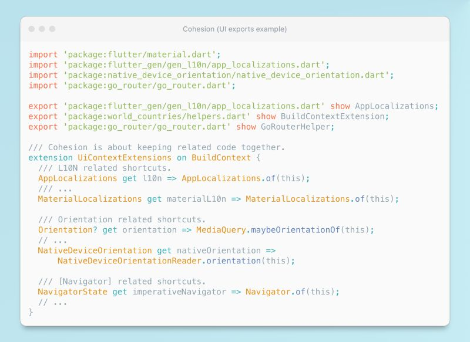

# Code Cohesion

## Description

Code cohesion refers to the practice of keeping related code together. This principle is integral to various aspects of your coding—from bundling related classes within modules to organizing methods in classes, and streamlining exports. Let's explore this with an example:

By grouping related imports to the exports—such as annotations or BuildContext extensions—into single files, you can significantly enhance your workflow and developer experience. In the realm of UI, common necessities include localization, navigation, and theme data, among others. Instead of importing these individually, why not create a comprehensive file that exports all the related items? For instance, by importing this file named "build_context_extensions.dart" (where you are grouping related exports) you centralize access to all these tools. This strategy not only reduces the number of import statements across your widgets but also fosters a logical grouping of related utilities, rendering your codebase more intuitive to navigate. Furthermore, when updates are needed—perhaps swapping a localization provider or router—you only need to amend a single file rather than hundreds of widgets. This will be especially appreciated by newcomers to your team, as they won't have to scour the codebase for that custom, elusive extension you crafted (and perhaps only you are aware of, kek).

> TLDR: embrace cohesion in your code. It's a small change with a big impact—making your project cleaner, more organized, and welcoming for contributors.
