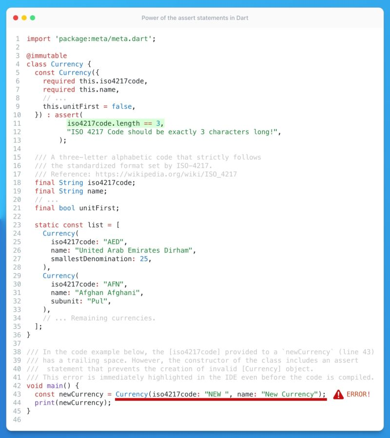

# Compile Time Constant Asserts

## Description

You probably all know Dart's "asserts", they are perhaps even less popular and produce even fewer business values, than widget tests because, in production code, assertions are simply ignored. But if you never tried to input both color and decoration parameters into a single Container at the same time — you are probably not a real Flutter developer :D.

While we often associate asserts with runtime errors, they can be even more effective when used within compile-time constants. For example, if you're working on a "Currency" class that must strictly adhere to the ISO standard (meaning the currency code must always be exactly three letters, as per ISO-4217), you can add an assert statement to the constructor. This will alert anyone attempting to create their own Currency with incorrect code right in the IDE!

## Example

Give it a try yourself in this [DartPad](https://dartpad.dev/?id=5ec11f88986f8a396f7ae5e09cf4087f)
