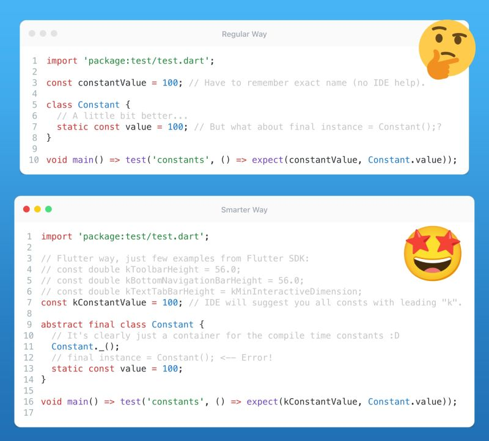

# Compile Time Constant References

## Description

Let's revisit the "number one tip for all rookie Dart developers" - compile-time constants. We all know the importance of using them wherever possible, but I know you're not here for beginner tips, right? 😄 Let's focus on accessing these constants.

In the world of Dart, there are essentially two popular ways to do it: using a helper class or making them global. However, what many tips fail to mention is considering the ease of access. For example, if you register your constant (let's say in the `constants.dart` file) as `constantValue = 100;`, you'll have to remember its exact name. Now, imagine having hundreds of constants in your codebase. To address this, the Flutter SDK often uses the prefix "k" (e.g., `kToolbarHeight`, `kBottomNavigationBarHeight`, etc.). This prefix allows your IDE to offer a list of all global constants starting with `k*`. However, a distinct disadvantage of this method is that you'll see all constants (starting with the letter "k") - both from the SDK and your own.

That's why many developers (including avid DCM users who appreciate the [prefer-static-class](https://dcm.dev/docs/rules/common/prefer-static-class) rule) prefer creating helper classes for static constants. These classes have names that describe their content, such as `UserInterfaceConstants` or `DatabaseConstants`. For example class `Constants { static const value = 100; }`. Now, most tips end here but think that these classes can be used by less experienced devs (especially via your pub packages). To clearly indicate that these classes are not instantiable and are purely just containers for constants, I recommend using sealed class or adding a private constructor and/or using the "abstract final" modifiers on the class (available since Dart 3), so every time a new-comer from other languages will try to create an instance of that class - he will be warned by the analyzer.

## Example

Give it a try yourself in this [DartPad](https://dartpad.dev/?id=77dd24dee91cf1d0e7c7448d071f5341)
