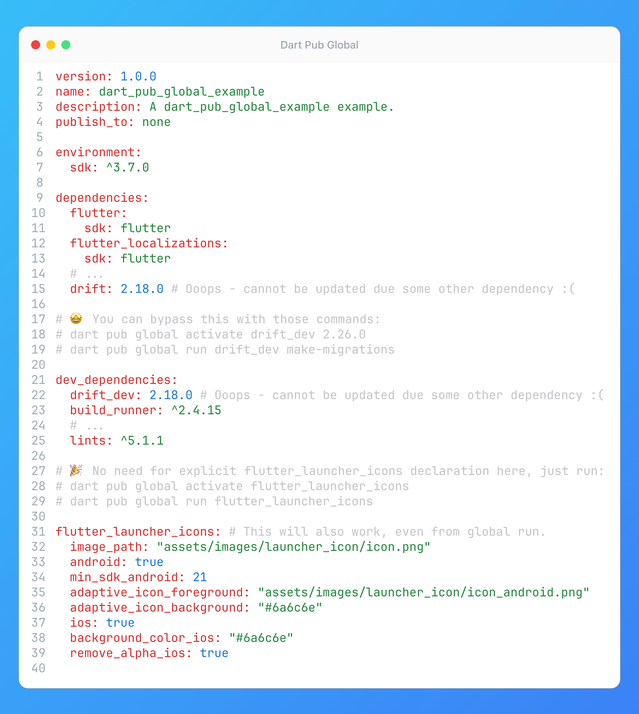

# Dart Pub Global



## Description

 Many of us were eagerly awaiting Dart Macros to simplify code generation. But it's clear now that we will still have to rely on `build_runner` and packages like `freezed`, `drift_dev`, `json_serializable`, etc.

However, this often leads to dependency hell, especially with code-gen tools (since they are all typically tightly connected to the `analyzer` package). Moreover, some tools are only needed rarely, cluttering your dev_dependencies. So here is a trick - a very underrated solution: `dart pub global`!

The Problem: Let's say you need the latest drift_dev for new migration features, but another dev dependency locks an older version, preventing drift_dev from updating in your pubspec.yaml.
The Solution: Bypass the local constraint by activating and running the tool globally:

```bash
dart pub global activate drift_dev 2.26.0
dart pub global run drift_dev make-migrations
```

> [!NOTE] Why this works:
> It installs `drift_dev` outside your project's dependency tree, avoiding the local conflict. Crucially, `dart pub global` run still respects your project's local build.yaml configuration!

Need another example? Here is the one to clean up dev_dependencies:
For tools you only run occasionally (like generating launcher icons), you can remove them entirely from your pubspec.yaml and just run them globally when needed:

```bash
dart pub global activate flutter_launcher_icons
dart pub global run flutter_launcher_icons
```

This keeps your dev_dependencies leaner and potentially speeds up pub get. This approach keeps development moving smoothly even when facing stubborn dependency conflicts with code-generation tools.

## Example

```yaml
version: 1.0.0
name: dart_pub_global_example
description: A dart_pub_global_example example.
publish_to: none

environment:
  sdk: ^3.7.0

dependencies:
  flutter:
    sdk: flutter
  flutter_localizations:
    sdk: flutter
  # ...
  drift: 2.18.0 # Ooops - cannot be updated due some other dependency :(

# 🤩 You can bypass this with those commands:
# dart pub global activate drift_dev 2.26.0
# dart pub global run drift_dev make-migrations

dev_dependencies:
  drift_dev: 2.18.0 # Ooops - cannot be updated due some other dependency :(
  build_runner: ^2.4.15
  # ...
  lints: ^5.1.1

# 🎉 No need for explicit flutter_launcher_icons declaration here, just run:
# dart pub global activate flutter_launcher_icons
# dart pub global run flutter_launcher_icons

flutter_launcher_icons: # This will also work, even from global run.
  image_path: "assets/images/launcher_icon/icon.png"
  android: true
  min_sdk_android: 21
  adaptive_icon_foreground: "assets/images/launcher_icon/icon_android.png"
  adaptive_icon_background: "#6a6c6e"
  ios: true
  background_color_ios: "#6a6c6e"
  remove_alpha_ios: true
```