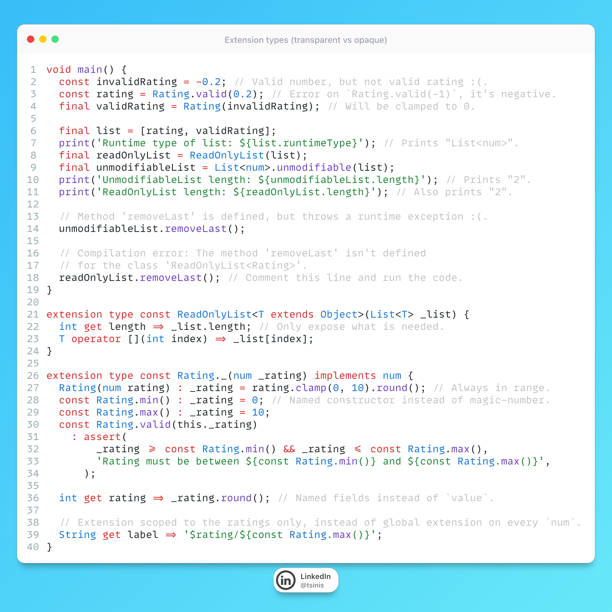

# Extension Types (Transparent vs Opaque)

## Description

DDD lovers this one is for you — let's talk about Dart extension types and why you should use them. They're perfect for turning primitives and final SDK types into real Value Objects with zero runtime tax:

- First, named constructors give you explicit factories that kill magic numbers/strings and centralize invariants (e.g., Rating.valid) so invalid states don't leak past the type boundary.
- Second, you keep domain logic scoped exactly where it belongs: on the concept itself (Rating.label) instead of polluting every num with global extensions or sprinkling validators across the codebase.
- Third, you get to pick your boundary style: opaque wrappers (like ReadOnlyList) expose only what the domain needs and make illegal ops unrepresentable at compile time; transparent wrappers (like Rating implements num) interop with existing num-based APIs while still adding domain semantics.

And the kicker for mobile apps: extension types are compile-time only—no extra allocations, no GC pressure, and member calls resolve statically so they can be inlined; even the type is erased at runtime (e.g., List<E> is List<R>), which means you retain the performance of the underlying primitives while gaining compile-time guardrails and a cleaner ubiquitous language.

Think about it, especially if you are into Domain Drive Design. Thanks!

## Example

Code from the picture is also available in this [DartPad](https://dartpad.dev/?id=80975458e240b81065d90f3542fefeb6)
