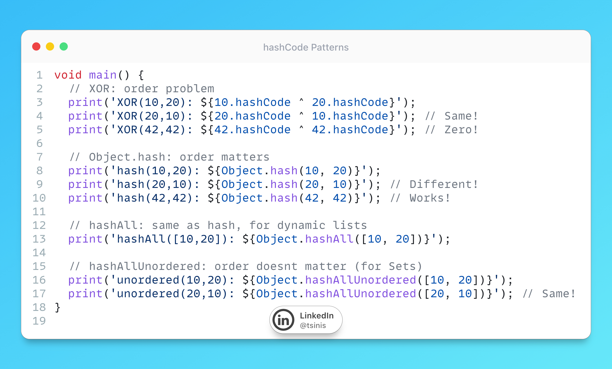

# hashCode Patterns



## Description

It's all about AI nowdays but a pesky little trend has been spreading - ask your "mini" model to create an immutable data class in Dart, most of those models still output the XOR pattern:

```dart
int get hashCode => x.hashCode ^ y.hashCode;
```

Many smaller and older models (but to be honest also some static IDE extensions) love this approach. This approach is coming from the old StackOverflow answers and pre-2021 tutorials. So, what is the problem? XOR has serious flaws:

1. Order doesnt matter: `Point(10, 20)` and `Point(20, 10)` get the SAME hash
2. Same values cancel out: `Point(42, 42)` produces hash of 0
3. Zero disappears: `0 ^ anything = anything`

Since Dart 2.14 we have `Object.hash()` which solves all of this. Built into the language, no packages needed.

```dart
int get hashCode => Object.hash(x, y);
```

Better bit distribution, order matters, no weird edge cases.

**Quick cheat sheet for the right method:**

- `Object.hash(a, b, c)` - for classes with fixed fields (up to 20). This is what you need 90% of the time.
- `Object.hashAll(list)` - when you have a dynamic list or more than 20 values.
- `Object.hashAllUnordered(set)` - when order doesnt matter, like comparing `Set`s or tag collections.

Next time your agent generates a data class, dont just hit accept. Check the most basic overrides! Its a small thing that can save you hours debugging weird HashMap behavior later.

## Example

Code from the picture (and more) is also available in this [DartPad](https://dartpad.dev/?id=4b67922628a4a729c95067bf3a6dad66)
