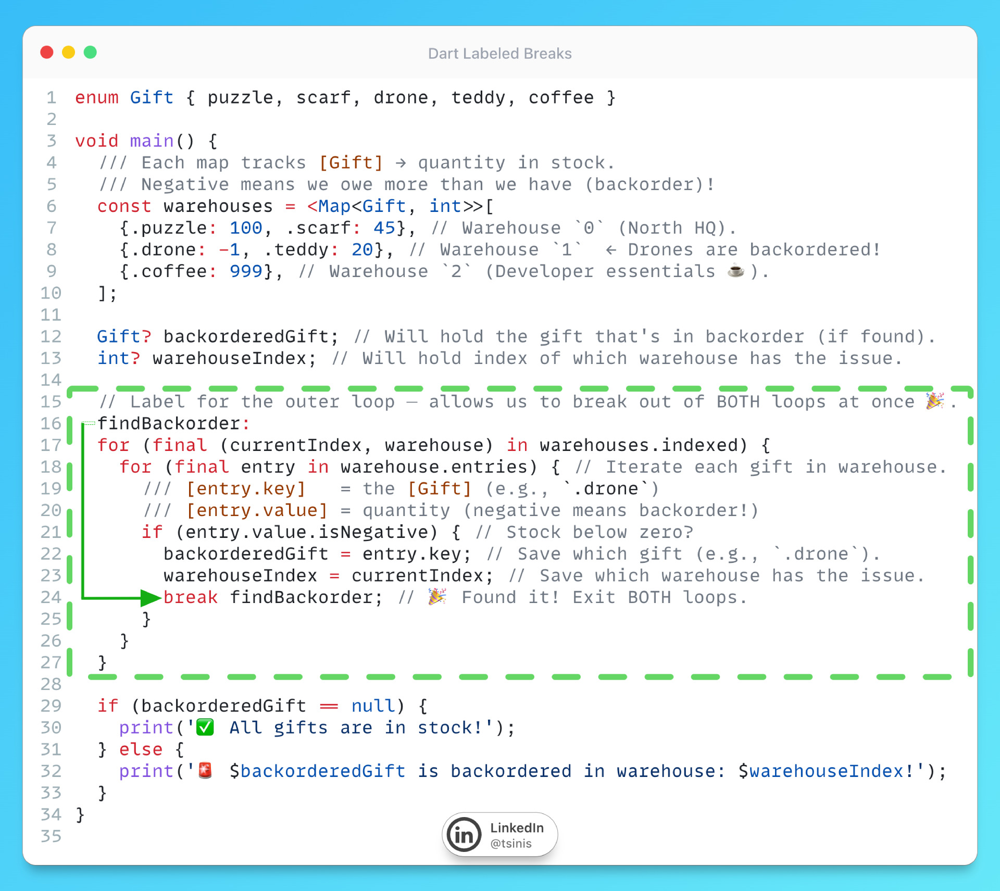

# Labeled Statements

## Description

Today's tip is about one of Dart's often-overlooked features: [labels](https://dart.dev/language/loops#labels), also known as labeled statements. In short, you can continue/break out of *multiple loops* with one clean move — no messy flags. Especially useful in nested loops and "find first match" scenarios, and at the same time, it makes your code cleaner and easier to read (compared to functional or boolean flag approaches).

Example: You're hunting for the first backordered item across warehouses. Once you find it, you want to bail out — completely. Instead of geeky nested collection extensions or juggling booleans like `isFound = true`, Dart lets you declare a label for your loops (e.g. `findBackorder`) and use it to break out of multiple loops at once:

`break findBackorder;` // 💨 Done. Both loops, gone.

It works in all kinds of loops (for, while, do-while, etc.) and in switch cases too (until for now, there is an idea to remove support for switch case labels)! A few other handy bits from Dart 3.10+ visible in the example:

- `.indexed` getter → on collections, get record of index & value together,
- dot-shorthands (`.drone` not `Gift.drone`) → less noise, more code,
- `.isNegative` → Not Dart 3.10+ just reads better :D

I keep running into devs who don't know labels exist — probably because most tutorials skip them (and also LLMs are not aware of them too 😄). Here's your reminder: sometimes Dart has already solved your problem years ago 😉

## Example

Code from the picture is as usual available in this [DartPad](https://dartpad.dev/?id=3590b96354b12826896657bd7ed9fbee)
