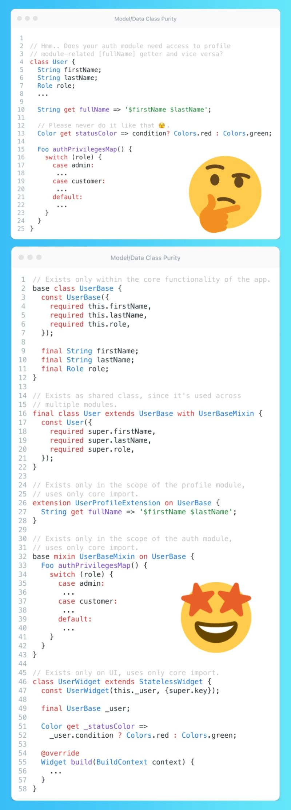

# Model Class Purity

## Description

It's quite common to see developers adding extra logic, like mappings and computed properties, directly into their model/data classes. For instance, having a `User` class with a `fullName` getter and role mappings in the same class. However, not all features require access to the user's full name or role mapping, right?

So, what's the solution? Extract that logic to extensions, mixins, and leverage the new class modifiers introduced in Dart 3 and embrace OOP! By doing this, you prevent your classes from getting bloated with unnecessary code. For example:

- For the `User` class, you can create an extension for the `fullName` getter (which will only be used within the relevant feature scope),
- and a `mixin` for the role mappings (specific to the auth feature), ensuring a clean and maintainable codebase,
- Create new class called `UserDataModel` that will extend `User` with additional `.fromJson()`/`.toJson()` methods, this way you can reference to `User` class as an output of your network service that will be responsible for fetching and deserializing of user data but other layers will work with this data as with super class `User`.

While this may increase the number of lines, it offers several benefits:

- Improved scalability: Separating the logic by feature or related blocks makes it easier to read, find, and replace with other entities.
- Easy detection of feature coupling: By examining the imports used in your code, you can quickly identify if your feature is relying on external modules outside of core/shared/common, flagging potential issues.
- Alignment with SOLID principles: This approach adheres to the Single Responsibility Principle (SRP), as the User class now focuses solely on storing user data.
- Reduced conflicts: By modifying existing classes less frequently, you can minimize conflicts (for example in GIT), especially when collaborating with a team.
- Better maintainability (without affecting the entire class with possible side effects), testability (focus on testing the specific functionality in isolation), reusability, and so forth.
