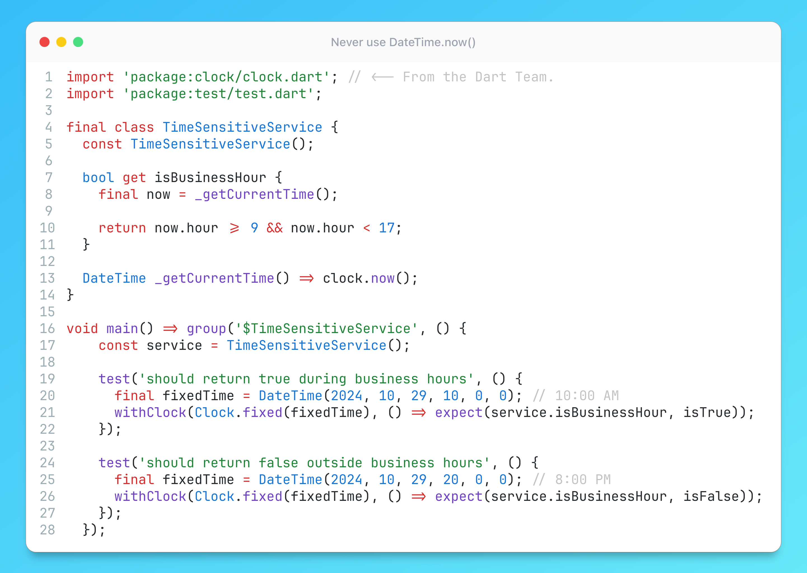

# Never use `DateTime.now()`

## Description

Never use `DateTime.now()` in your code! This tip might seem basic, but you'd be surprised how often this method sneaks into the prod. This is a common sign of unreliable code and it isn't just a Dart problem—it's a pitfall in many programming languages, here's why:

1. Non-Mockable: `DateTime.now()` is not easily mockable, making it difficult to write reliable tests.
2. Time Zone Issues: Your tests in CI most likely run in different time zones, leading to inconsistent results.
3. Daylight Saving Time: Similar to point 2 - changes in daylight saving time can cause your pipelines to fail unexpectedly.

In Dart, the official Google [clock](https://pub.dev/packages/clock) package provides a `Clock` class that can be used to get the current time (and test functions like `withClock` for mocking). By using `clock.now()` (especially the UTC version of it — to avoid time zone issues), you can easily mock the current time in your tests without affecting production code. This approach is applicable in many other languages as well — look for libraries that provide a mockable clock or time service in your favorite language.

If you can't use a library dependency, at least make your methods or constructors accept an optional date-time parameter (annotated with `@visibleForTesting`, ideally) for better testability. Now that you understand the problem - feel free to use this method directly, when it makes sense. :)

## Example

Unfortunately for some incomprehensible reason `clock` package is not yet supported in DartPad. So, an example is available in [Zapp](https://zapp.run/edit/clock-example-zd16606mqd167?entry=test/main_test.dart&file=test/main_test.dart).
