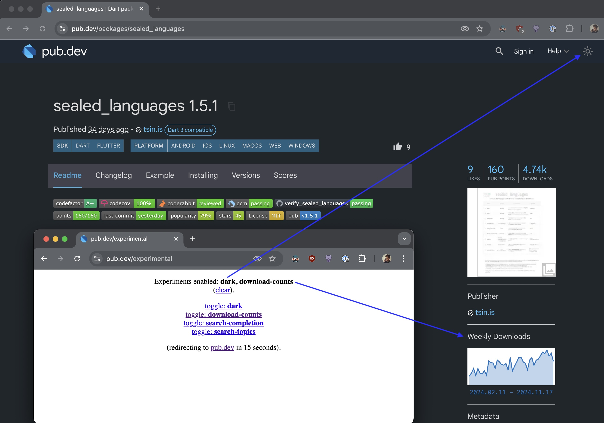

# Pub.dev Experimental

## Description

Let’s get back to the roots, namely the place where we spend a lot of time - the pub.

"What's up with the pub.dev, right? It's Dart written, isn't it?" - "Psst! Well, there is a hidden place where you can experiment with the latest features flags!" Yes, you can be part of the future of Dart itself! pub.dev/experimental is your backstage pass to the latest and greatest Dart features. For example try these experimental flags:

- `toggle:dark:` Enable dark mode for a sleek, night-time coding experience.
- `toggle:download-counts:` See how popular packages are with download counts and trends (just like NPM, but better!).
- `toggle:search-completion:` Get smarter search suggestions as you type.
- `toggle:search-topics:` Filter search results by topic for a more focused experience.

So, what are you waiting for? Dive into the future of Dart today!

## Example

Access it at [pub.dev/experimental](https://pub.dev/experimental)
