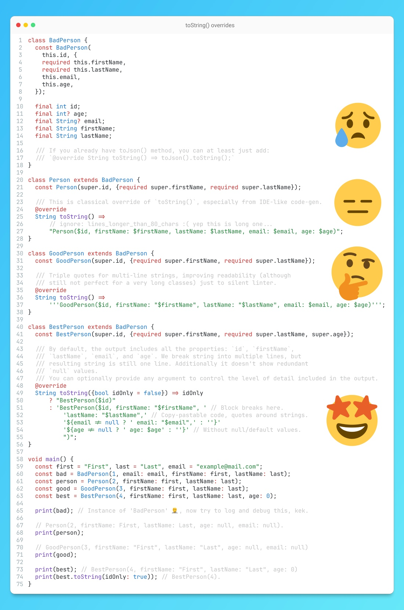

# toString() overrides

## Description

You know how every senior developer can tell if a project might be good or bad just by glancing at the `pubspec.yaml` file for a minute? The same goes for classes — especially in third-party dependencies. By looking at the `toString()` override, you can get a pretty good sense of the quality of the code.

A well-crafted `toString()` can reveal hidden clues about a class's design, intentions, and even potential pitfalls. Let's break down the case of toString() in the provided picture:

- **The Bad Guy**: The `BadPerson` class is a prime suspect. It has no toString() implementation so everything you will see causing errors in your error-monitoring tool is `Instance of 'BadPerson'`...
- **The Average Joe**: `Person` is a step up, but still falls short. It provides some details but includes potentially irrelevant/default information, like a person's age when it might not be necessary and just ignoring line length issues :(
- **The Good Citizen**: `GoodPerson` uses a "hack" of multi-line strings for better readability, but still lacks the finesse of a true detective.
- **The Master Detective**: `BestPerson` is our hero. It has a toString() implementation that's not just informative but also customizable. The idOnly flag allows you to control the level of detail, making it a versatile tool for debugging and logging. Also, it has block breaking for better dev-ex and readability. So output will only contain suitable information and can be used as a copy-paste Dart code.

So, why is toString() so important?

- **Debugging**: A well-crafted `toString()` can be your lifeline when debugging complex issues. It provides valuable insights into the state of objects and helps you identify problems quickly.
- **Code Readability**: A clear and concise toString() implementation makes your code more understandable, both for yourself and for others who might work on it in the future.
- **Efficiency**: By using toString() effectively, you can avoid unnecessary logging of irrelevant or private information and/or debugging efforts, saving time and resources.

Think about it, especially if you are developing your code for other devs. Thanks!

## Example

Code from the picture is also available in this [DartPad](https://dartpad.dev/?id=9b228da4598ff932c854f8d42cb5eb33)
