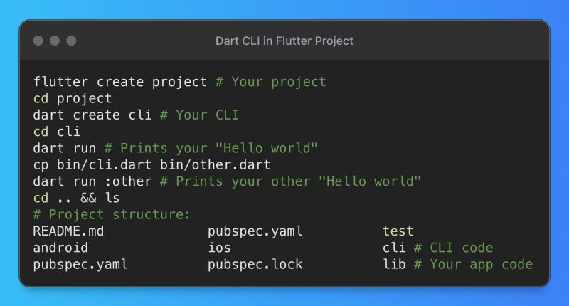

# Dart Scripts

## Description

Today, I want to talk about a hidden gem of every Flutter project... I've worked on many different projects, and almost all of them used helper scripts and CLI tools for routine and/or one-off tasks. For example:

- Downloading, updating and converting SVG icons to TTF/OTF fonts.
- Downloading, parsing and updating support/contact info from a REST API to use in the offline app.
- Automatically editing app file names, screenshots, and their report and changelog for app stores.
And so on. If you're an experienced developer, you've probably seen folders like `tools`/`scripts` in projects (regardless of tech-stack). These are usually in 80% of cases just simple Bash scripts that run in CI/CD environments.

But did you know that you can create much richer, safer, and multi-platform scripts directly in your project with Dart? Dart is one of the best languages for creating CLI tools!

Here are a few reasons why:

- Dart also gives you access to commands you would otherwise use via (`Process.run`), I/O operations, file system access, and more.
- Dart tools will run the same on every device (forget about bash problems on Windows), regardless of platform.
- Dart developers/contributors can easily review and modify Dart CLI code like any other Dart/Flutter code.
- Dart is a compiled language, which means that Dart code is converted to native machine code before it is executed. This can make Dart CLI applications very fast.
- You don't need to download any other massive dependencies, like NPM. The Dart SDK is part of the Flutter SDK, which you already have everywhere on your project.
- You have access to packages from pub.dev, so you don't need to write your own Git tools or HTTP client solutions. Everything already exists in thousands of open-source packages.
- You have compile-time safe access to your project's Dart code using relative imports (without Flutter and other not imported dependencies, obviously).
- The same ecosystem is being utilized without the need for a switch in the developer context.

Dart CLI can handle flavors and infrastructure configs (AWS, Firebase, Analytics, etc.), data processing, file and system management, DevOps, code generation, and pretty much anything you can expect from CLI tools/scripts, without any problems.
