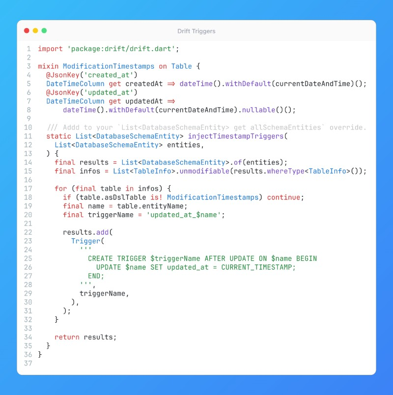

# Drift Triggers



## Description

What I love about mobile dev is that it’s the perfect blend of frontend and backend. We craft attractive UIs and animations but also juggle deeper “backend-like” tasks: architecting state management, reacting on the underlying platform lifecycles, handling concurrency with isolates, dealing with the hardware (camera, Bluetooth, GPS, file system, AR/VR), running local ML models, processing heavy image/audio/video data, and optimizing for performance and security on each device. On top of that, we have commercial restrictions—publishing to app stores brings its own rules, guidelines, and release cycles.

It’s a self-contained environment: you own the whole app bundle, from user interaction to memory usage and encryption. You can’t just move all logic to the server because an offline-first mobile app (especially a cross-platform one) must gracefully handle local data and states. Also, obviously, data must be stored offline, so we have to manage the local storage cache (and its invalidation), write migrations, and so forth.

My favorite DB solution is good old SQLite, but with the elegance of [Drift](https://pub.dev/packages/drift), because it handles low-level SQL details and allows the developer to write concise, strongly typed database code. So my tip will be about one of my favorite features - triggers. They are not very well documented, but you can create for example fields like createdAt and updatedAt with automatic timestamps with just one mixin attached to any table where you need this info!

## Example

```dart
import 'package:drift/drift.dart';

mixin ModificationTimestamps on Table {
  @JsonKey('created_at')
  DateTimeColumn get createdAt => dateTime().withDefault(currentDateAndTime)();
  @JsonKey('updated_at')
  DateTimeColumn get updatedAt =>
      dateTime().withDefault(currentDateAndTime).nullable()();

  /// Addd to your `List<DatabaseSchemaEntity> get allSchemaEntities` override.
  static List<DatabaseSchemaEntity> injectTimestampTriggers(
    List<DatabaseSchemaEntity> entities,
  ) {
    final results = List<DatabaseSchemaEntity>.of(entities);
    final infos = List<TableInfo>.unmodifiable(results.whereType<TableInfo>());

    for (final table in infos) {
      if (table.asDslTable is! ModificationTimestamps) continue;
      final name = table.entityName;
      final triggerName = 'updated_at_$name';

      results.add(
        Trigger(
          '''
            CREATE TRIGGER $triggerName AFTER UPDATE ON $name BEGIN
              UPDATE $name SET updated_at = CURRENT_TIMESTAMP;
            END;
          ''',
          triggerName,
        ),
      );
    }

    return results;
  }
}
```
