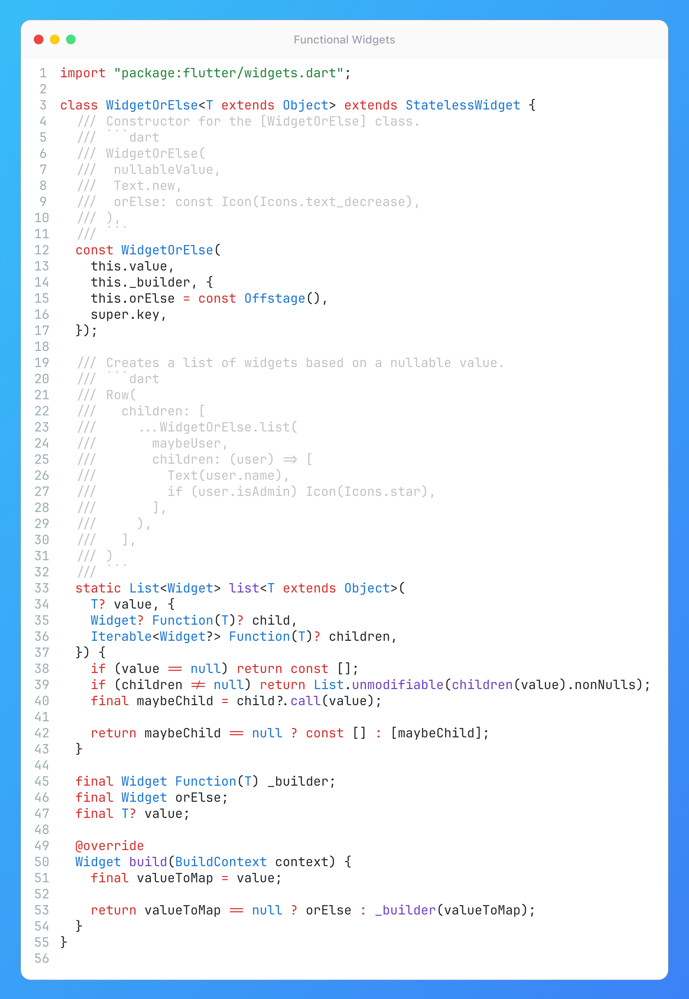

# Functional Widgets

## Description

Dart is often seen as a strictly object-oriented language, but in reality, it's multi-paradigm – blending object-oriented approaches with functional programming concepts. So, what does it mean for us in practice?

As you remember, in Flutter *"Everything is a Widget"* - which means the widget could be functional too! So, why not explore a functional approach to widget composition? In this example - `WidgetOrElse`, you can conditionally build widgets in an elegant, functional style, and instead of writing verbose if statements to render content based on nullable values, `WidgetOrElse` encapsulates the logic nicely.

## Example

Give it a try yourself in this [DartPad](https://dartpad.dev/?id=9a07645e83dd178b3febeba36a5fca5c)
