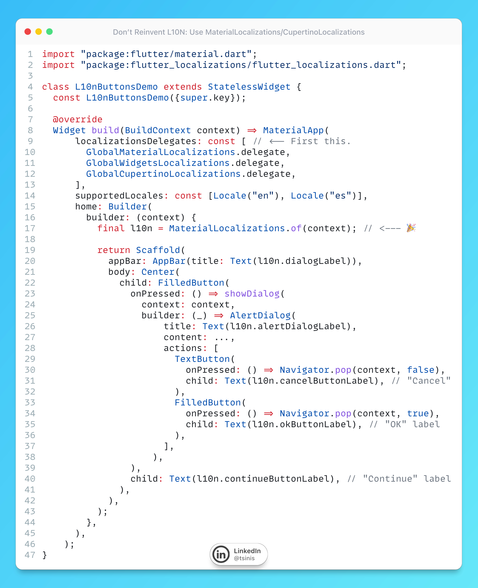

# Flutter SDK Localizations

## Description

This one is also called "Don't Reinvent L10N: Use `MaterialLocalizations`/`CupertinoLocalizations`".

We often need translations for common buttons like OK, Cancel, Close, Copy, Paste, etc. But here's the thing: Flutter already has these translated in 79 languages for Material and 78 for Cupertino, so why create your own? Instead of providing something like:

- ❌ `AppLocalizations.of(context).okButton`

you can use:

- ✅ `MaterialLocalizations.of(context).okButtonLabel`.

The win? Free professional translations, less maintenance, and your app stays consistent with platform standards. Just make sure you have [GlobalMaterialLocalizations.delegate](https://api.flutter.dev/flutter/flutter_localizations/GlobalMaterialLocalizations-class.html) and [GlobalCupertinoLocalizations.delegate](https://api.flutter.dev/flutter/flutter_localizations/GlobalCupertinoLocalizations-class.html) in your app's `localizationsDelegates`
Available labels include: `okButtonLabel`, `cancelButtonLabel`, `closeButtonLabel`, `saveButtonLabel`, `copyButtonLabel`, `pasteButtonLabel`, `deleteButtonTooltip`, `backButtonTooltip`, and tons more!

## Example

Give it a try yourself in this [DartPad](https://dartpad.dev/?id=e501d7e4af68d8a38c673006e94a556e) - as you can see, no hardcoded strings are used for common buttons; instead, we leverage Flutter's built-in localizations.
