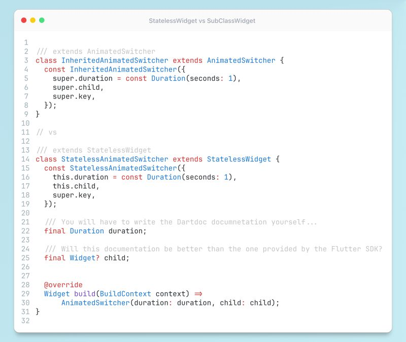

# Flutter SDK Sub-Class Widgets

## Description

I have another advanced Flutter tip for you - "Don't extend StatelessWidget"!

Sorry for the clickbait :D. So, because you are reading this now - you already understand the importance of breaking down long/big widgets into smaller ones. We are typically refactoring those huge (300+ lines of code) classes into smaller ones by extracting child components as `StatefulWidget`/`StatelessWidget`. While this is a common way to create reusable widgets in Flutter, it's not the only option, especially if your component has only 1 or 2 children inside (typically some default `Padding`, `SizedBox`, `ColoredBox`, etc.). Instead of extending `StatelessWidget` try to extend those sub-classes (so `MyPadding extends Padding`). Why?

I'm also a big fan of "Composition over Inheritance" (especially if you are turning a blind eye to this `extends StatelessWidget` part, kek :) but it's not a universal rule, let's not forget that Dart is the object-oriented language, so Inheritance is a fundamental concept there. Here is why you should consider extending the implementation of sub-classes instead of more general abstractions:

- Smaller class declarations.
- Inherits properties, methods, and even documentation of the widget properties, methods, etc.
- Adds more tailored data to the debugging information provided by the parent class via `debugFillProperties`.
- Smaller "widget trees" (let's not call them like that), as there is no additional *Widget wrapping your widget.
- Check your DevTools and thank me later :)

As you can see this is a perfect scenario for your basic UI components, like buttons, paddings, margins, gaps, boxes, and so forth. Still not convinced? Check the source code of one of the most popular widgets in Flutter SDK - [Center](https://github.com/flutter/flutter/blob/ec8fcbceccffacdc4fd4b4fa2e31505babfeba2d/packages/flutter/lib/src/widgets/basic.dart#L2190-L2193)!

Write your code as Flutter SDK dev and next time you're breaking down your widgets, consider both options. Each has its strengths and weaknesses, and the best choice depends on your specific needs.

## Example

Give it a try yourself in this [DartPad](https://dartpad.dev/?id=7c7f812ec9b169014016c5b73f0e45a8)
