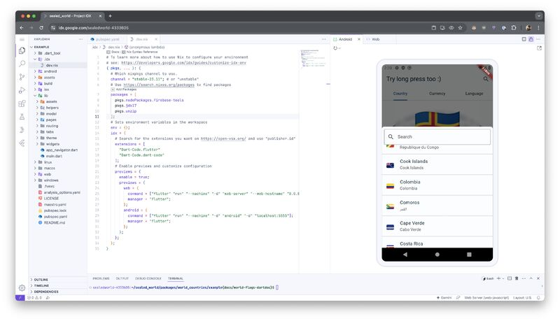

# Virtual Environments

## Description

I'm going to talk about the dev environment, but not about your fancy sets and tables - but rather the lack of them:

- Imagine you spilled coffee on your notebook, but you have to deliver a new feature for a customer in an hour.
- Or you're failing to catch the "work's on my machine" related error.
- Or you want to onboard your new colleague in a neutral environment until he has his hardware.
- Or you want to experiment with otherwise rarely used frameworks/SDKs and don't want to bloat your machine.

And so forth. Yes, I'm talking about virtual environments. GitHub Codespaces offers a ready-to-go dev environment in minutes. With just one super-simple `.devcontainer.json` file is often enough to get started. Best part? It's free for individual users up to **60 hours a month** (and yes you can use your free minutes even in your organization's private repos). After that, it's pay-as-you-go.

For Flutter fans, Project IDX is another option. Its out-of-the-box setup for Flutter and virtual devices is impressive. But Codespaces might win for monorepo support and better GitHub/VS Code integration.
Give them a try, it's just a one-time setup! You'll thank me later (especially when your local environment goes wrong).

## Example

- GitHub Codespaces config [example](https://github.com/tsinis/sealed_world/blob/main/packages/world_countries/example/.idx/dev.nix)
- Project IDX config [example](https://github.com/tsinis/sealed_world/blob/main/.devcontainer/devcontainer.json)
