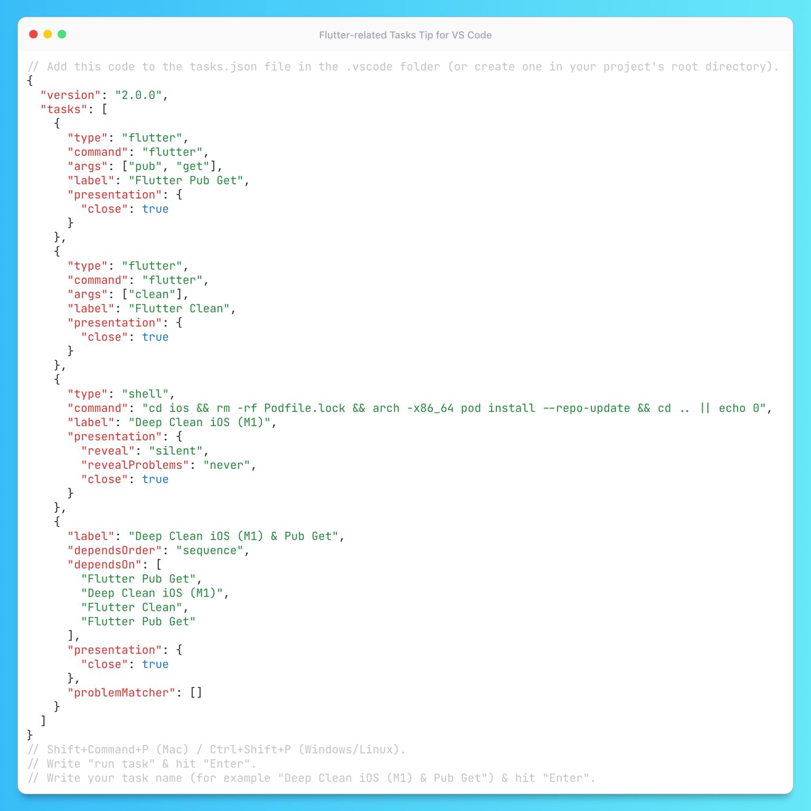

# Flutter VS Code Tasks

## Description

Imagine you're back from vacation, and your Flutter project on iOS is not building anymore because your colleagues updated the native dependencies there. So you have to go through several phases of updating Flutter and native dependencies, cleaning, etc. Or another example: before pushing your code for review, you want to format it, analyze it, test it, run it, etc., and finally GIT-push it to a remote repository.
Lots of tasks, I would say you can go with Command-Line Shortcuts (Aliases) or even better - just share those flows/tasks across your team with VS Code Tasks! You can run these tasks in just 4 small steps:

1. Add the `tasks.json` file to the `.vscode` folder (or create one in your project's root directory).
2. Press <kbd>Command</kbd>+<kbd>Shift</kbd>+<kbd>P</kbd> (Mac) / <kbd>Ctrl</kbd>+<kbd>Shift</kbd>+<kbd>P</kbd> (Windows/Linux).
3. Write `run task` & hit <kbd>Enter</kbd>.
4. Write your task name (for example, "Flutter Test & Format & Analyze") & hit <kbd>Enter</kbd>.

In the link below you will find my tasks.json with the most common tasks and combinations I use. Feel free to modify/combine/create your tasks and combinations. Enjoy!

## Example

For detailed instructions, please refer to the following Gist: [Gist Link](https://gist.github.com/tsinis/d707f8557576ec6014698088e1917f0d)