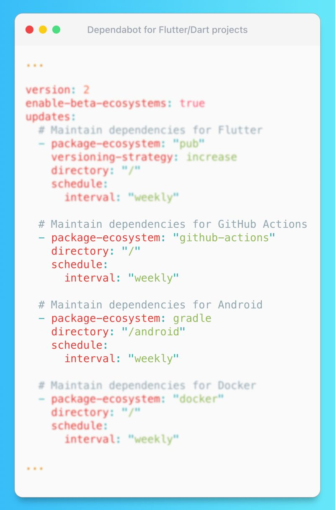

# Dart/Flutter Dependabot

## Description

I would like to highlight Dependabot - a fantastic free feature provided by GitHub that automates dependency updates. You're probably already aware of it, especially considering the recent big announcement about the "pub" ecosystem support. So, I assume you already have it set up and running smoothly.
However, Flutter is not just limited to a single platform, so, as Dependabot - it can handle various other ecosystems! For example, it can manage Gradle-related updates for your Android project's dependencies (or your Flutter package example). Or for example, since you're using GitHub, you probably utilize the Workflows feature for CI/CD - you can keep your GitHub Actions up to date with it too (we all remember the breaking action migrations from Node12 to Node16, right?). Dependabot supports a wide range of other ecosystems such as `npm`, `docker`, `pip`, etc.!

> TLDR: If you are a GitHub user, I highly recommend leveraging Dependabot and exploring all the relevant ecosystems it supports (not just "pub"). It is an incredibly powerful tool that enhances the security and freshness of your projects. Combined with automatic tests in CI/CD pipelines, it can save you countless hours of maintenance work.

## Example

As always, I'd like to provide a demonstration of a real project's [dependabot.yaml](https://github.com/tsinis/colors_ai/blob/main/.github/dependabot.yaml)
