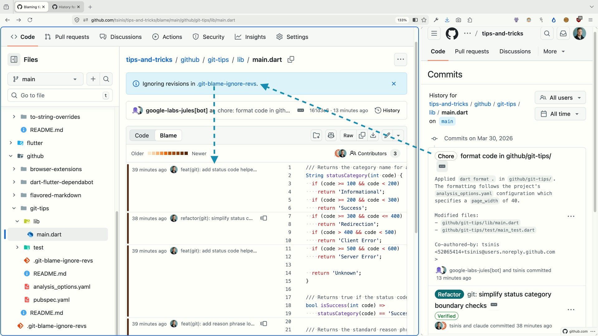

# Git Tips

[](https://github.com/tsinis/tips-and-tricks/blame/main/github/git-tips/lib/main.dart)

## 1. .git-blame-ignore-revs

When someone runs a bulk `dart format .` or a large refactor, every touched line shows them in `git blame` — hiding the real author. The fix: list those commit SHAs in `.git-blame-ignore-revs`, and blame skips them.

```bash
# Create the file, add formatting commit SHAs
echo "161d3c698b0caef8822cb36d108ec89a2f80a14b" >> .git-blame-ignore-revs
git config blame.ignoreRevsFile .git-blame-ignore-revs
```

### Example with this project

This project has a formatting commit by `google-labs-jules[bot]` that reformatted all code to `page_width: 40`. Compare:

```bash
# Without ignore — Jules shows as author of reformatted lines
git blame github/git-tips/lib/main.dart

# With ignore — blame skips the formatting commit, shows real authors
git blame --ignore-revs-file github/git-tips/.git-blame-ignore-revs github/git-tips/lib/main.dart
```

> **Note:** GitHub automatically recognizes `.git-blame-ignore-revs` at the repo root.

---

## 2. git bisect run

`git bisect` uses binary search to find the commit that introduced a bug. Instead of manually marking commits as good/bad, `git bisect run` automates it — you give it a command (like `dart test`), and Git decides based on the exit code:

| Exit code        | Meaning                                 |
| ---------------- | --------------------------------------- |
| 0                | Good commit                             |
| 1-124, 126, 127  | Bad commit                              |
| 125              | Skip (can't test, e.g. doesn't compile) |

### Bisect example with this project

This project has a deliberate bug introduced in one of its commits. You can find it automatically:

```bash
# Start bisect
git bisect start
git bisect bad HEAD                    # current commit is broken
git bisect good 05f5f5c               # first commit was working fine

# Automated run — let the tests decide good/bad
# Note: bisect checks out at repo root, so we cd into the subproject
git bisect run sh -c 'cd github/git-tips && dart test test/main_test.dart'

# Git finds the first bad commit automatically

# Done — clean up
git bisect reset
```

### Real-world example

Say a test started failing at some point in your project. You'd do:

```bash
# Clone and enter
git clone https://github.com/tsinis/functional_status_codes.git
cd functional_status_codes

# Start bisect
git bisect start
git bisect bad HEAD                    # current commit is broken
git bisect good v0.1.0                 # this tag was working fine

# Automated run — let the tests decide good/bad
git bisect run dart test test/functional_status_codes_test.dart

# Git outputs something like:
# abc123def is the first bad commit
# Author: ...
# Date: ...
# "refactor: changed status code mapping"

# Done — clean up
git bisect reset
```

### Tips

- The command you pass to `bisect run` can be anything — a test runner, a script, a linter.
- For projects that don't compile on some commits, wrap your command in a script that returns 125 on build failure:

```bash
#!/bin/sh
dart compile exe bin/main.dart || exit 125
dart test
```

---

## 3. git rerere

`git rerere` ("reuse recorded resolution") remembers how you resolved merge conflicts and silently re-applies the same resolution next time. Enable it globally:

```bash
git config --global rerere.enabled true
```

### The gotcha

If you resolve a conflict **incorrectly**, abort/undo the merge, and later retry the same merge — rerere silently re-applies the **wrong** resolution.

How to fix it:

```bash
git rerere forget <path>    # forget resolution for a specific file
git checkout -m <path>      # re-checkout the conflicted version to redo it
```

### Notes

- Stored resolutions accumulate in `.git/rr-cache/` — negligible disk usage, cleaned by `git rerere gc`.
- Historically had a GPG pin prompt issue, but fixed since Git 2.38.
- **Verdict:** Safe to enable globally. Just remember — if you mess up a conflict resolution, run `git rerere forget .` before retrying.
